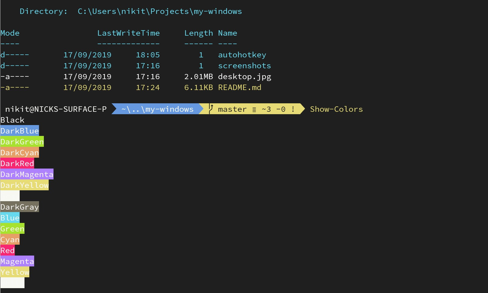

# Monokai Night for [Windows Terminal](https://github.com/Microsoft/Terminal)

# Installation

* To install, copy-paste the contents of `scheme.json` into the `schemes` section of your Windows Terminal
settings, `Ctrl + ,` to open them.
* Add/Modify `"colorScheme": "Monokai Night"` in respective profile to activate.
